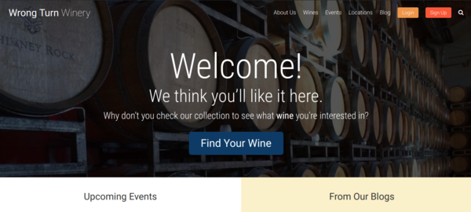

# Wrong Turn Winery Theme

<p align="center">
  
</p>

Version: 1.0.0

## Demo

You can find a demo of the Wrong Turn Winery Theme at [www.wrongturnwinery.com](https://www.wrongturnwinery.com)

## Authors

Adam Abundis ([adamabundis.xyz](https://adamabundis.xyz) / [GitHub profile](https://github.com/abuna1985) )

## Summary

A custom WordPress theme for a winery. Uses Bootstrap 4, SCSS, AutoPrefixer, and Gulp for all processing tasks. Included custom posts like Wines, Events, Locations, Staff, and Notes.  Built a search page that uses the WP REST API and ES6 JavaScript to search all pages, posts, and custom posts. Syncs changes across local development devices with BrowserSync. Tested up to WordPress 5.1.

## Usage

The theme is setup to use [Gulp](https://gulpjs.com/) to compile SCSS (with source maps), run it through [Autoprefixer](https://www.npmjs.com/package/autoprefixer), lint, concatenate and minify JavaScript (with source maps), optimize images, and syncs changes across local development devices with [BrowserSync](https://www.npmjs.com/package/browser-sync), with flexibility to add any additional tasks via the `gulpfile.js`.

### Features

1. Media Queries can be nested in each selector using SASS.
2. SCSS with plenty of mixins ready to go.
3. Gulp for processing all SASS, JavaScript and images, and cross-device refreshing with BrowserSync.
4. Search page made with WP REST API and ES6 JavaScript to search all pages, posts, and custom posts.


### Suggested Plugins

* [Advanced Custom Fields](https://wordpress.org/plugins/advanced-custom-fields/)
* [All-in-One WP Migration](https://wordpress.org/plugins/all-in-one-wp-migration/)
* [Crop-Thumbnails](https://wordpress.org/plugins/crop-thumbnails/)
* [Members – Membership & User Role Editor Plugin](https://wordpress.org/plugins/members/)

## Prerequisites

**Requires at least:** WordPress 4.4

**Tested up to:** WordPress 5.1

Please make sure you have Node.js installed. You can find the link to download [Node.js here](https://nodejs.org/en/) and [WordPress here](https://wordpress.org) 

```javascript
// Verify Node was installed by running this command in your terminal
node -v
// You should get something like...
v12.8.1 // it may be a higher version number than this
```

## Getting Started

After downloading this repo, go to your terminal in the project root directory and install all the npm dependencies first.

```
npm install
```

## Running a Build

### Compiles and hot-reloads in a development environment

```
npm run gulpwatch
```

### Compiles and minifies CSS for a production environment

```
npm run gulpstyles
```


### Compiles and minifies JavaScript for a production environment

```
npm run gulpscripts
```

## Built With

* [WordPress](https://wordpress.org) - content management system used
* [Gulp](https://gulpjs.com) - Automating the CSS builds
* [Webpack](https://webpack.js.org) - Automating the JavaScript builds
* [Vagrant](https://www.vagrantup.com) - Development Server

## License

This project is licensed under GPLv2 or later - see the [license link](http://www.gnu.org/licenses/gpl-2.0.html) for details

## Credits

* [Bootstrap 4](https://getbootstrap.com/docs/4.6/getting-started/introduction/)
* [SASS / SCSS](http://sass-lang.com/)
* [AutoPrefixr](https://www.npmjs.com/package/autoprefixer)
* [BrowserSync](https://www.npmjs.com/package/browser-sync)
* [Vagrant-LAMP dev environment](https://github.com/LearnWebCode/vagrant-lamp)

